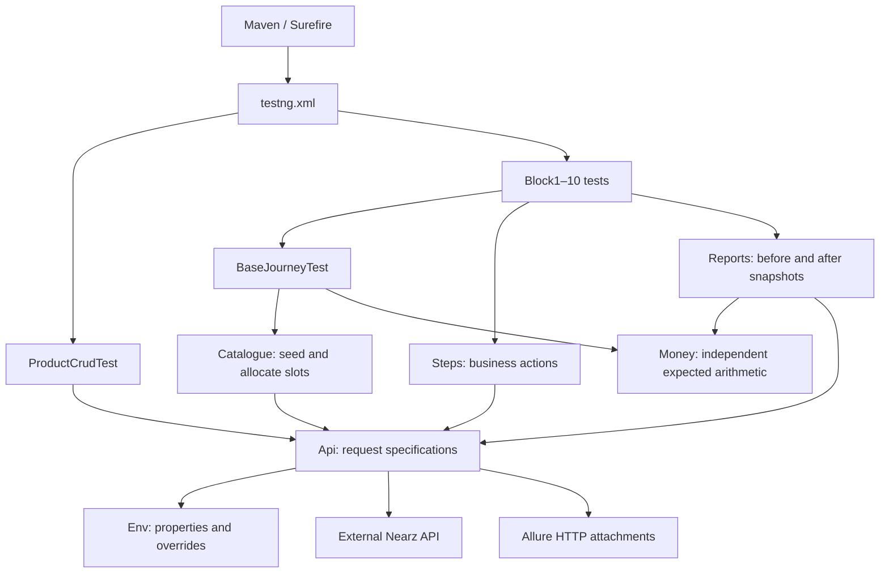

# Technical architecture

## Scope and stack

Nearz API tests are a Maven **test-only** Java project (`com.nearz:nearz-api-tests`).
All executable sources live under `src/test/java/com/nearz/api`; no application
server or database implementation is present. The external API owns persistence,
authentication, billing and report generation. Backend class names in comments
record earlier investigation; their implementations cannot be verified here.

| Component | Repository version / responsibility |
|---|---|
| Java | Release 17 |
| REST Assured + JSON Path | 5.5.0; HTTP requests and response extraction |
| TestNG | 7.10.2; setup, tests, assertions, groups and skips |
| Hamcrest | 2.2; fluent response assertions |
| Jackson Databind | 2.17.2; serializes request maps |
| Surefire | 3.2.5; Maven-to-TestNG execution |
| Allure adapters | 2.29.0; test results and HTTP attachments |
| Allure Maven plugin | 2.12.0; renders reports |

`pom.xml` is authoritative for versions. Runtime results in the README and
`docs/RUN_RESULTS.md` are historical evidence, not a fresh health check.

## Execution and dependencies

Tests also make direct REST Assured calls when an assertion needs a specific
endpoint. This is a small set of static helpers, not an enforced layered framework.

| Source | Role and extension point |
|---|---|
| `Env.java` | Loads required classpath config; Java system properties override values |
| `Api.java` | Journey, owner, other and anonymous request specs; JSON, bearer auth, Allure; optional status/content-type/5-second response specs |
| `Catalogue.java` | Opens working days, reads tax/round-off settings, finds or seeds named stock/services/staff; allocates today's free slots |
| `Steps.java` | Concrete HTTP actions returning IDs or JSON; enquiry, appointment, bill, payment, refund, staff, expense and dashboard helpers |
| `Money.java` | BigDecimal, HALF_UP rounding, inclusive/exclusive tax, discount cap and whole-rupee settlement; tolerance 0.01 |
| `Reports.java` | Selected report summaries flattened into `report.kpi` maps; computes after-minus-before deltas |
| `BaseJourneyTest.java` | `@BeforeClass(alwaysRun=true)` seeding and shared record/report assertions |
| `ProductCrudTest.java` | Standalone introductory CRUD shape with local cleanup helpers |
| `VerifyDefectsTest.java` | Opt-in diagnostic audit, mostly printed verdicts; inherits mutating setup |

## Business journey and oracle

A representative journey creates an enquiry, converts it to a customer, books
and completes an appointment, creates a bill and finalizes payment. IDs flow
through helper return values. Appointment/customer linkage uses the mobile
number (`on_behalf_of_mobile_no`), not a `customer_id` request field.

Checks combine transport status, persisted record fields, and affected report
deltas. `Steps.settleInFull` reads `net_payable` to send a valid payment, but the
assertion's expected money must be computed independently from catalogue inputs
and `Money`. Echoing an API total back as the expected total cannot detect a
calculation defect. Not every test exercises all three layers; negative and
lifecycle cases assert the relevant subset.

`Reports.snapshot` requests `range=today` and a unique `_qa` query parameter to
avoid the observed 60-second cache. It extracts `data.kpis.<name>.value`.
MONEY_TRAIL, COST_TRAIL and calendar lists limit calls to relevant reports.
Missing/null numeric values currently become zero, and absent delta keys default
to zero; add explicit presence assertions when absence itself should fail.

## Domain coverage and selection

| Test class | Case range / subject |
|---|---|
| Block1EnquiryTest | 001–025, enquiry conversion; also D16 reproduction |
| Block4AppointmentTest | 026–050, appointment lifecycle |
| Block5BillTest | 051–075, bill construction |
| Block2PaymentTest | 076–100, payment and settlement |
| Block3RefundTest | 101–125, refunds |
| Block6StaffTest | 126–150, staff, attendance and commission |
| Block7InventoryTest | 151–170, stock and product costs |
| Block8ExpenseTest | 171–180, expense ledger and profit |
| Block9DashboardTest | 181–185, dashboard reconciliation |
| Block10CompositeTest | 186–200, combined journeys |

Ranges are identifiers, not a count of currently executing methods. Some cases
are skipped or removed as duplicates. Search annotations and `SkipException`
for current status. `testng.xml` runs CRUD, then blocks 1, 4, 5, 6, 7, 8, 9, 10,
2 and 3, serially. XML excludes `known-defect`; direct `-Dtest` selection bypasses
the XML, so use the explicit group filters in [setup](../SETUP.md).

## State, isolation and failure boundaries

- Journey tenant 4550 is the default write target; owner 4536 is read-only by
  convention; other tenant 1725 retains data for cross-tenant checks. Configurable
  IDs and request specs do not enforce authorization or prohibit production.
- Exact report deltas require exclusive use of the journey tenant. Thread count
  one prevents overlap within the suite, but not another process or human writer.
- Calendar reservations survive a run. Default capacity is 19 slots × 20 roster
  stylists per day, with availability also constrained by actual staff/calendar
  state. Unique customer phones prevent conversion into an existing customer.
- Settings altered by a test must be restored in `finally`. There is no global
  teardown, rollback or backend reset. Even selecting one method can seed data.
- Dates use local Java time. Avoid date rollover and align the machine's date
  with the target salon. The shared same-day guard only protects callers using it.
- HTTP 200 is insufficient evidence of success (D1); deletion can return 500
  after deleting a product (D15). Preserve explicit defect assertions and verify
  resulting state rather than retrying mutations blindly.
- Allure captures HTTP payloads and authorization headers without explicit
  redaction in this repo. Reports and local config must stay out of commits.

## Limits and documentation ownership

This suite does not provide schema validation, database assertions, load testing,
or concurrent execution coverage. The response budget applies only where
`Api.ok()` / `Api.created()` are used. Diagnostic verdicts are not a CI gate.

Use [API_TEST_PLAN.md](API_TEST_PLAN.md), [DEFECTS.md](DEFECTS.md) and case catalogs
as supporting evidence. `coverage_gaps.md`, endpoint inventories and the archived
Python suite describe earlier work and may refer to backend paths or tools absent
here. Do not treat them as an executable Java coverage report.

Update this document when helper responsibilities or execution flow change;
update [SETUP.md](../SETUP.md) for configuration/commands and
[AGENT_HARNESS.md](AGENT_HARNESS.md) for validation and agent workflows.
